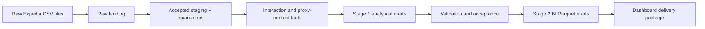

# Expedia Product Analytics

[](https://github.com/antony502189-max/expedia-recsys/actions/workflows/product-analytics-ci.yml)

A reproducible DuckDB analytics pipeline for the Expedia Hotel Recommendations competition data. It turns the supplied logged interactions into validated analytical marts, then produces a separate, dashboard-oriented BI layer without modifying the accepted source build.

> The dataset contains logged click/booking interactions, not a complete Expedia funnel. `booking_interaction_share` is therefore a descriptive share of logged interactions—not a search-to-booking conversion rate, revenue metric, or causal product KPI.

## Overview

The project is designed for reliable exploratory product analytics on a large, anonymized historical dataset. Its two core stages are deliberately separated:

1. **Stage 1 — analytical data product:** raw landing, typed staging, row-preserving quarantine, facts, dimensions, analytical marts, and acceptance checks.
2. **Stage 2 — dashboard BI layer:** narrow Parquet exports, canonical field names, dashboard specifications, and independent reconciliation back to the accepted Stage 1 build.

The pipeline preserves source lineage, checks grain and rate invariants, and records generated artifacts outside Git.

## Features

- DuckDB-based, reproducible build of analytical facts, dimensions, and marts.
- Source-content reconciliation and row-preserving quarantine for invalid records.
- Grain, uniqueness, range, daily/monthly, and numerator/denominator quality gates.
- Wilson confidence intervals and support levels for sparse entity comparisons.
- Explicit handling of proxy contexts, observed recurrence, missingness, and booking-population drift.
- Immutable, versioned build directories with manifests, hashes, and exact build comparison.
- Dashboard-ready Parquet marts with source reconciliation and delivery-package validation.

## Architecture



## Tech Stack

| Layer | Technology |
|---|---|
| Language | Python 3.11+ |
| Analytics engine | DuckDB |
| Packaging | `uv` and Hatchling |
| Data formats | CSV, DuckDB, Parquet, JSON |
| Testing and linting | pytest and Ruff |
| CI | GitHub Actions |

## Project Structure

```text
config/                    Data and acceptance contracts
docs/                      Data dictionary, quality rules, BI specifications
scripts/                   Build, validation, export, and delivery commands
sql/analytics/             Stage 1 analytical mart SQL
src/expedia_analytics/     Analytics pipeline and Stage 2 BI builder
src/expedia_recsys/        Original recommendation-system utilities
tests/                     Unit and synthetic integration tests
data/                      Local source data and generated builds (ignored)
artifacts/                 Local manifests and validation evidence (ignored)
deliverables/              Local dashboard packages (ignored)
```

## Getting Started

### Prerequisites

- Python 3.11 or later
- [uv](https://docs.astral.sh/uv/)
- The Expedia source files in `data/raw/` for a full Stage 1 build:
  - `train.csv` or `train.csv.gz`
  - `test.csv` or `test.csv.gz`
  - `destinations.csv` or `destinations.csv.gz`

### Install

```powershell
uv sync --frozen --group dev
```

### Run checks

```powershell
uv run --frozen ruff check .
uv run --frozen pytest -q
```

### Build and validate Stage 1

Use resource values appropriate for the local machine:

```powershell
uv run --frozen expedia-analytics --threads 7 --memory-limit 32GB build-final
uv run --frozen expedia-analytics validate-final
uv run --frozen expedia-analytics inspect-final
```

The PowerShell launcher offers the same workflow:

```powershell
powershell -ExecutionPolicy Bypass -File .\scripts\run_product_analytics.ps1 -Threads 7 -MemoryLimit 32GB
```

### Build and validate Stage 2 BI marts

Stage 2 reads the accepted Stage 1 build in read-only mode and writes separate BI exports under `data/bi/<build-id>/`.

```powershell
uv run --frozen python scripts/build_bi_layer.py
uv run --frozen python scripts/validate_bi_layer.py
uv run --frozen python scripts/audit_stage2_bi_delivery.py
uv run --frozen python scripts/package_stage2_bi_delivery.py
uv run --frozen python scripts/package_stage2_bi_delivery.py --verify
```

Use `--replace` with the build command only when intentionally regenerating an existing BI export.

## Quality and Semantics

The main outcome is:

```text
booking_interaction_share = booking_rows / logged_interaction_rows
```

The supplied data does not include complete searches, impressions, checkout steps, payments, cancellations, revenue, or the full Expedia traffic population. Accordingly:

- proxy contexts are not real sessions;
- observed recurrence is not retention;
- destination and hotel-market entities remain distinct;
- observed segment differences are associations, not causal effects;
- sparse entities must be interpreted with support levels and confidence intervals.

See the [data dictionary](docs/data_dictionary.md), [metric dictionary](docs/metric_dictionary.md), [quality rules](docs/data_quality_rules.md), and [BI mart guide](docs/bi_dashboard_marts.md) for detailed definitions.

## Documentation

- **Stage 1:** [architecture](docs/marts_architecture.md), [quality rules](docs/data_quality_rules.md), and [final data product](docs/final_data_product.md).
- **Stage 2:** [dashboard specification](docs/stage2_dashboard_spec.md), [KPI dictionary](docs/stage2_kpi_dictionary.md), and [final BI audit](docs/stage2_final_bi_audit.md).
- **Stage 3:** [analytical summary](docs/stage3/analytical_summary.md), [evidence register](docs/stage3/evidence_register.md), and [acceptance checklist](docs/stage3/acceptance_checklist.md).

## Generated Artifacts

Large local artifacts are intentionally excluded from Git:

- source datasets and processed outputs under `data/`;
- analytics manifests and acceptance evidence under `artifacts/`;
- BI delivery exports under `data/bi/` and `deliverables/`.

This keeps the repository reproducible without committing large datasets or generated packages.

## Configuration

The project has no runtime environment variables or committed credentials. Build behavior is defined by the checked-in analytics contracts in `config/`.

## Contributing

Create a focused branch, keep generated data out of commits, run Ruff and pytest, and ensure any change to data semantics is reflected in the relevant contract and documentation.

## License

No license file is currently included. Do not assume reuse rights beyond those granted by the repository owner and the source dataset terms.
